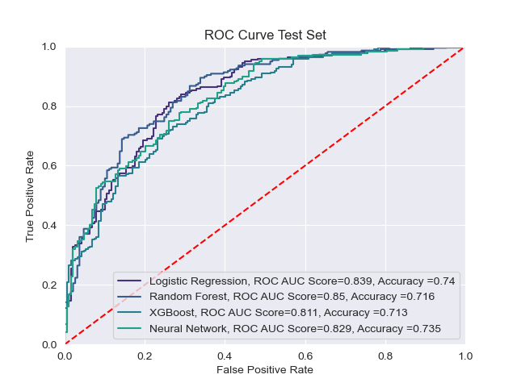
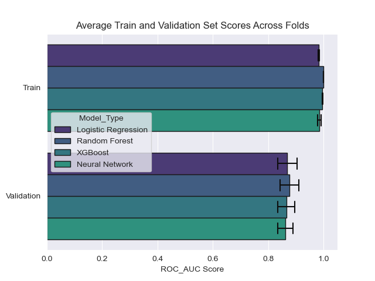
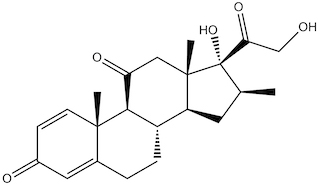

# Blood Brain Barrier Permeability 

The Blood Brain Barrier (BBB) refers to the membrane between blood vessels and brain tissue that regulates the passage of substances between the blood and brain. From a therapeutics perspective, the BBB's regulatory function poses a challenge of discovering what molecules\drugs can cross the barrier in order to address neurological diseases. 

The purpose of this project is to develop models that can predict if a molecule can permeate the barrier (binary classification).

## Results and Analysis

### Models and Hyperparameter Tuning
I defined and compared logistic regression, tree-ensemble, and dense neural network models. In order to find optimal hyperparameters I defined ranges of hyperparameters and implemented the grid-search strategy and evaluated the performance of each combination of the hyperparameters using k-fold cross validation. The data was split according to an 80-20 train-test ratio, and the train set was split into 4 folds. 

| Model      | Tuned Hyperparameters|
| ----------- | ----------- |
| Logistic Regression      |  'C' (low C values  corresponds to an increased regularization strength on coefficients)  |
| Random Forest  | 1. Number of estimators, 2. Number of features considered when splitting  |
| XGBoost| 1. Step Size Shrinkage (learning rate), 2. L2 penalty on leaf values 3. Subsample Ratio |
| Dense Neural Network | 1. Dropout,  2. L2 penalty on Weights of Model  |

 

## Discussion and Future Work
There exists a class imbalance in the data: 24% of the data is in the negative class (not able to cross the BBB). For further investigation, I would consider techniques such as up-sampling the minority class. All of the models have similar ROC AUC and accuracy scores. I would want to explore how an increase in data would influence the generalization errors of the models and if this would lead to greater differences in the performance between the models. In a higher resourced environment, I would consider different sets of hyperparameters and larger ranges for its values, and use a different search strategy for finding optimal hyperparameters such as bayesian optimization.

## Libraries
https://deepchem.readthedocs.io

A key library that was used in this project is DeepChem. DeepChem is a python library created for applying machine learning to the sciences. For chemistry purposes, it provides functions for creating useful representations of molecular data sets. DeepChem also has defined its own object classes essential for machine learning systems, such as Dataset, Metric, and Model classes. This provides a consistent framework for training and evaluating machine learning models. For example, once we have defined models\estimators in libraries such as scikit-learn or tensorflow, these models can be wrapped as DeepChem models.

## Data and Featurization 
The dataset[1] consists of 2053 molecules along with a label (0 or 1) signifying if the molecule can pass through the barrier. The molecules are represented as simplified molecular-input line-entry system (SMILES) strings, which is a string representation of the molecule. This string encodes information such as atoms and bonds.

Example: Meprednisone
SMILES representation:

SMILES String:`[C@H]12[C@@]([C@](C(CO)=O)(O)[C@H](C1)C)(CC(=O)[C@H]3[C@H]2CCC4=CC(=O)C=C[C@]34C)C`

A key aspect of the DeepChem library is its 'featurization' functions. These are functions that produce numerical representations of the SMILES strings. The featurization function I used is the molecular fingerprint featurizer which produces Extended Connectivity Fingerprints (ECFPs).

Abstractly we can view the molecular fingerprint featurizer as transforming a SMILES string into a binary array of a fixed length(2048 in our case). The algorithm[2] parses through the molecule and computes lists of integers at each atom that correspond structural information about the molecule. Then, using a hash function, these lists are converted into integers, which are then converted to indices of an array of fixed length. The binary array takes value 1 at these indices and 0 every else. The 1s and 0s loosely encode what structural patterns a molecule has and does not have.

# References
[1] https://deepchemdata.s3-us-west-1.amazonaws.com/datasets/BBBP.csv
\
[2]https://arxiv.org/pdf/1509.09292.pdf
